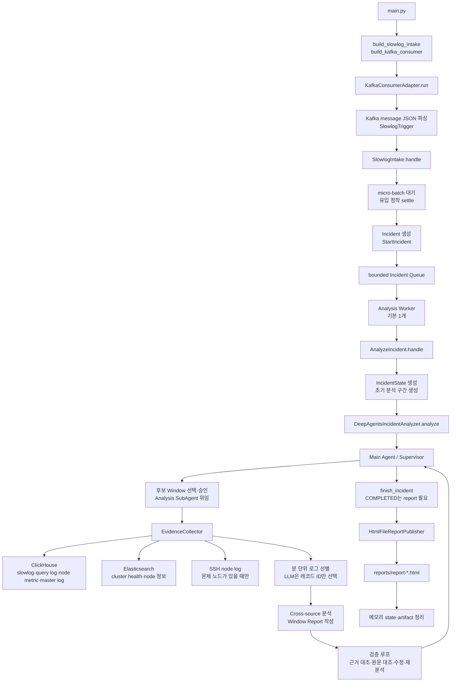

# ClusterDoctor

ClusterDoctor는 Kafka의 Elasticsearch slowlog 트리거를 받아 유입이 멎기를 기다린 뒤,
인시던트 하나를 진단해 HTML 보고서 한 장을 만든다. 요청을 받는 HTTP 서비스가 아니라 계속
실행되는 Kafka consumer이며, HTTP analysis endpoint는 없다.

## 동작과 아키텍처

```text
ES slowlog → Filebeat → Elasticsearch data stream → Kafka source connector
                                                   ├→ ClusterDoctor trigger
                                                   └→ ClickHouse slowlog_v2
```

같은 connector output이 두 갈래로 가므로, 트리거가 도착할 때 ClickHouse에는 대체로 분석할
데이터가 들어와 있다. Kafka 수신부터 최종 보고서까지의 흐름은 다음과 같다.

```text
KafkaConsumerAdapter
  → SlowlogHandler port
  → SlowlogIntake: micro-batch, quiet-period settling
  → StartIncident
  → bounded Incident Queue → Analysis Worker (기본 1개)
  → AnalyzeIncident: state, timeout/cancellation, delivery, cleanup
  → IncidentAnalyzer port: DeepAgents composite adapter
  → application report finalization and HTML publication
```

`SlowlogIntake`는 `MICRO_BATCH_SECONDS` 동안 도착분을 묶고, 15초 간격으로 유입을
확인해 연속 두 번 신규 항목이 없을 때 Incident를 만들어 큐에 넣는다. 한 번의 대기는 최대
60초, 누적 대기는 최대 5분이다. 기본 큐 용량은 100개이며 단일 worker가 순서대로 진단한다.
기존 Incident 분석 중 들어온 새 이벤트도 별도로 settling되어 다음 Incident로 큐에 들어간다.
새 이벤트를 분석 중인 Incident에 자동 합치거나 기존 Incident를 다시 실행하지 않는다.

의존성은 안쪽으로만 향한다.

```text
inbound adapters → application → domain ← outbound adapters
                         ↑
                    bootstrap composition
```

도메인은 incident 상태, guardrail, time range, evidence, 보고서 타입, 순수
근거 일관성 검증 정책(`validate_report`)을 가진다. application은 port와 use case를 조정하며 Kafka,
LangChain, LangGraph, DeepAgents, LiteLLM을 import하지 않는다. `bootstrap`만 구현체를
선택한다.

### Port와 adapter

Application port는 `SlowlogHandler`, `IncidentAnalyzer`, `IncidentStateRepository`,
`ArtifactStore`, `LogRepository`, `ClusterRepository`, `NodeResolver`, `NodeLogFetcher`,
`ReportPublisher`다.

- inbound Kafka adapter는 record를 `SlowlogTrigger`로 파싱해 `SlowlogHandler`에 넘긴다.
  `aiokafka` 의존성은 이 adapter에만 있다.
- ClickHouse는 `LogRepository`, Elasticsearch는 `ClusterRepository`와 `NodeResolver`,
  SSH는 `NodeLogFetcher`, persistence는 state/artifact port, HTML reporting은
  `ReportPublisher`를 구현한다.
- `adapters.outbound.deepagents`는 하나의 composite outbound adapter다. 공개 API는
  `DeepAgentsConfig`와 `build_deepagents_incident_analyzer`뿐이다. factory는 설정과
  application port 객체를 받아 structured LiteLLM caller, `ReportWriter`, metric
  threshold, `AnalysisSeams`, private `_DeepAgentIncidentAnalyzer`를 내부에서 조립한다.
  bootstrap은 runtime, supervisor, diagnosis, pipeline internals를 import하지 않는다.

Main DeepAgent는 incident마다 새 graph를 만들고 tool loop를 돈다. 먼저 후보 window를
열거하고, 허용된 window를 선택·승인(`propose_analysis`)한 뒤 진단 subagent에 `task`로
위임한다. 위임 결과(`LogAnalysisResponse`)의 요약을 읽고 공백이 남았으면 추가 window를
분석하고, 없으면 `finish_incident`로 종료한다. Main Agent의 도구는 `list_candidate_windows`,
`propose_analysis`, `finish_incident` 셋뿐이며, 시간·분·호출 상한은 runtime guardrail이 강제한다.

Subagent는 승인된 window 하나를 끝까지 처리한다. evidence를 모으고 Window Report를
작성한 뒤, LLM 도구가 아닌 코드 루프(`_run_validation_loop`)가 리포트를 검증한다.
`validate_report`가 근거 id·시각·노드·순서·과장·인과 같은 구조화 필드를 대조하고,
`GroundingValidator`가 Claim을 evidence 원문과 대조한다. 표현 불일치는 `revise_report`로
최대 2회 고치고, 분석 불일치는 같은 window를 1회 다시 분석한다. 그래도 남으면
`MISMATCH`로, 원문을 대조하지 못했으면 `NOT_VERIFIED`로 리포트를 저장하고 반환한다.
`COMPLETED` 종료에는 window report가 하나 이상 있어야 한다.

window report는 합치지 않고 window마다 `IncidentState.report_refs`에 따로 쌓는다.
`AnalyzeIncident`는 마지막 window의 report를 대표로 HTML에 전달하고, 모든 window의 검증
불일치를 gap으로 싣는다. Candidate를 prompt에 보이는 방식과 HTML에 보이는 방식은 각
adapter 안에서 따로 projection한다.

## 분석 모델

Supervisor는 raw log를 보지 않는다. Agent 사이에는 request/response와 reference만 흐르고,
evidence·원문·report·observation은 `ArtifactStore`에 둔다. 그래야 supervisor context가 raw
log로 불어나지 않는다.

각 datasource는 raw log를 1분 bucket으로 나눠 Map/Reduce로 evidence를 고른다. 모델은 번호와
선택 이유만 돌려주며 timestamp, node, 원문은 code가 원본 record에서 옮긴다. Reduce는 root
cause를 확정하지 않는다. 모든 datasource evidence가 모인 뒤 cross-source 단계가 원인 후보를
다룬다. 비어 있는 분은 호출하지 않고, 실패한 분은 `[분석 실패]`와 gap으로 남긴다.

노드 metric은 LLM을 거치지 않는다. heap, queue, rejected의 임계값을 넘은 최고점을 code가
evidence로 만든다. master node log는 ClickHouse에서 매 window 읽고, data node log는 master
evidence로 후보가 생겼을 때만 `NodeResolver`와 SSH를 통해 읽는다.

## 보고서

Incident 하나당 `REPORT_DIR` 아래 HTML 파일 하나를 쓴다. `IncidentAnalysisReport`는 code가 센
`observations`와 모델이 쓴 `narrative`를 분리한다. 숫자와 slow-query candidate 값은 code가
정확히 아는 값이므로 모델에게 옮겨 적게 하지 않는다. Narrative의 주장에는 evidence reference가
붙고, Subagent의 검증은 window의 evidence와 보고서를 대조해 없는 reference,
evidence 없는 주장, candidate/time/node 불일치, 순서, 과도한 확신, 인과 역전과 모순을
검사하고, 주장이 원문과 맞는지도 확인한다.

모델이 빈 draft를 주거나 report 저장이 실패해도 observation은 전달한다. HTML 파일을 쓸 수
없으면 scrubbed plain text를 log로 남긴다. 모든 text는 escape하며 report 파일은 query 원문과
company/user 식별자를 담을 수 있으므로 `reports/`는 Git에 넣지 않는다.

## 요구 사항

- Python 3.13 이상과 [uv](https://docs.astral.sh/uv/)
- slowlog topic을 전달하는 Kafka
- slowlog, query log, node metric, node log table을 가진 ClickHouse
- cluster health 조회용 Elasticsearch
- Gemini 또는 NVIDIA NIM API key 하나
- 선택: data-node log를 읽을 SSH credential

## 설정

환경 변수 또는 project root `.env`를 `src/cluster_doctor/config/settings.py`가 읽는다.
`.env.example`을 `.env`로 복사하고 실제 key는 commit하지 않는다. 필수 설정이 없으면 첫
slowlog까지 기다리지 않고 기동 시점에 실패하며, 오류는 secret value를 출력하지 않는다.

| 변수 | 기본값 | 설명 |
|---|---:|---|
| `LLM_PROVIDER` | `gemini` | `gemini` 또는 `nvidia_nim` |
| `GEMINI_API_KEY`, `NVIDIA_API_KEY` | — | 선택한 provider의 key |
| `GEMINI_MODEL` | `gemini-3.5-flash-lite` | Gemini model |
| `NVIDIA_MODEL` | `google/gemma-4-31b-it` | NIM model; local cost map에 없어 cost가 0일 수 있음 |
| `CLICKHOUSE_URL` | — | 예: `jdbc:clickhouse://host:8123/packetbeat`; 이 database에 아래 네 table이 있어야 함 |
| `CLICKHOUSE_USER`, `CLICKHOUSE_PASSWORD` | `default`, empty | ClickHouse credential |
| `CLICKHOUSE_SLOWLOG_TABLE`, `CLICKHOUSE_LOG_TABLE` | `slowlog_v2`, `log` | slowlog와 query log table |
| `CLICKHOUSE_NODE_METRIC_TABLE`, `CLICKHOUSE_NODE_LOG_TABLE` | `es_node_metric`, `loki_logs` | node metric과 master-node log table |
| `ES_HOST`, `ES_PORT` | —, `9200` | comma-separated host와 port |
| `ES_USER`, `ES_PASSWORD` | empty | 비면 basic auth를 사용하지 않음 |
| `SSH_USER`, `SSH_PASSWORD`, `SSH_PORT` | empty, empty, `22` | data-node log용 SSH |
| `KAFKA_BOOTSTRAP_SERVERS`, `KAFKA_TOPIC`, `KAFKA_GROUP_ID` | `localhost:9092`, `slowlog`, `clusterdoctor` | consumer 설정 |
| `MICRO_BATCH_SECONDS`, `CLUSTER_NAME` | `10`, `elasticsearch` | batch interval과 표시 이름 |
| `NODE_HEAP_WARN_PERCENT`, `NODE_QUEUE_WARN` | `85`, `100` | metric evidence threshold |
| `REPORT_DIR` | `reports` | Incident HTML output directory |
| `LITELLM_LOCAL_MODEL_COST_MAP` | `True` | litellm의 GitHub cost-map fetch를 막음 |

Kafka offset은 `(group, topic, partition)` 기준이다. 새 topic에 committed offset이 없으면
`auto_offset_reset=latest`로 끝에서 시작한다.

### 고정 한도

다음은 환경 변수가 아닌 runtime 상수다. 위치는 현재 hexagonal package 구조를 기준으로 한다.

| 한도 | 값 | 위치 |
|---|---:|---|
| analysis window | 10분 | `domain/analysis/time_range.py` |
| incident analysis budget | 60분, 12회 | `domain/incident/guardrails.py` |
| supervisor cycle / rejected decision | 16회 / 3회 | `domain/incident/guardrails.py` |
| final report revision | Incident당 최대 1회 | `domain/incident/guardrails.py` |
| settling wait | 60초 each, 300초 total | `domain/incident/guardrails.py` |
| incident timeout | 30분 | `domain/incident/guardrails.py` |
| evidence | source당 25, 전체 80 | `domain/incident/guardrails.py` |
| raw prompt text | 60,000자 | `domain/incident/guardrails.py` |
| node investigation | 2 nodes | `adapters/outbound/deepagents/analysis/pipeline/node_investigation.py` |
| Incident Queue / analysis worker | 100개 / 1개 | `bootstrap/dependencies.py` |
| source query rows | source·minute당 10,000 | `adapters/outbound/clickhouse/reader.py` |
| master log | window당 300, report당 120 | `adapters/outbound/deepagents/analysis/pipeline` |
| ClickHouse node-log | default 300, hard cap 2,000 | `application/ports/log_repository.py` |
| SSH node-log | default 300 | `application/ports/node_log_fetcher.py` |
| SSH timeout | connect 10초, command 30초 | `domain/incident/guardrails.py` |
| LLM timeout | 120초 | `adapters/outbound/deepagents/runtime/litellm_client.py` |
| ClickHouse timeout | 30초 | `bootstrap/dependencies.py` |

### 재시도와 rate limit

LLM 호출은 `litellm.completion(num_retries=0)` 경로만 쓴다. 가장 흔한 실패는 429이고, 같은 큰
prompt를 재시도해도 quota를 회복하지 못하며 token 소비만 증가한다. Gemini free tier의
분당 입력 token 250,000에 대해 5분 window가 약 513,122 input token을 쓴 실측이 있다.
추가 window 분석, 리포트 수정·재분석, 원문 대조 검증도 추가 token을 소비한다.

client는 status와 whitelist된 rate-limit header만 log로 남긴다. response body, request URL,
`str(exc)`는 key를 포함할 수 있어 기록하지 않는다. retry를 끈 대가로 일시적인 5xx도 자동
retry하지 않지만, failed minute은 전체 incident를 버리지 않고 gap으로 보고된다.

## 설치와 실행

```bash
uv sync
uv run python -m cluster_doctor.main
```

Kafka consumer는 block하며 log는 stderr와 `logs/app.log`, report는 `REPORT_DIR`에 남긴다.
실제 slowlog를 기다리지 않는 trigger 확인에는 다음을 쓴다.

```bash
uv run python scripts/produce_test_message.py --at "2026-09-16T04:22:00" --count 3
```

### Docker Compose 통합 실행

실제 Gemini 또는 NVIDIA NIM API를 호출하는 로컬 통합 실행이다. Kafka trigger 수신,
ClickHouse 조회, Elasticsearch cluster health 조회, LLM 분석, HTML 보고서 생성을 한 번에
확인한다. Docker에서는 Kafka·ClickHouse·Elasticsearch만 실행하고, ClusterDoctor는
로컬 가상환경에서 실행한다. `.env`에 LLM API key와 아래 연결 설정을 넣는다.

```dotenv
CLICKHOUSE_URL=jdbc:clickhouse://localhost:8123/packetbeat?compress=0
CLICKHOUSE_USER=clusterdoctor
CLICKHOUSE_PASSWORD=clusterdoctor
ES_HOST=localhost
ES_PORT=9200
ES_USER=
ES_PASSWORD=
KAFKA_BOOTSTRAP_SERVERS=localhost:29092
KAFKA_TOPIC=slowlog
KAFKA_GROUP_ID=clusterdoctor
```

```bash
docker compose up -d
.venv/bin/python -m cluster_doctor.main
```

`Kafka consumer started`가 보이면 다른 터미널에서 trigger를 보낸다. consumer의 `auto_offset_reset=latest` 때문에 consumer 기동 전에 보낸
메시지는 읽지 않는다.

```bash
.venv/bin/python scripts/produce_test_message.py --at "2026-01-15T10:00:00+09:00"
```

고정된 fixture 시각은 오래된 이벤트로 처리되어 분석 구간에서 제외될 수 있다.
근거 수집까지 검증하려면 ClickHouse 데이터와 이벤트 시각을 최근의 동일한 구간으로 맞춘다.

초기 정착 대기와 실제 LLM 호출이 끝난 뒤 `reports/`에 HTML 파일이 생긴다.

```bash
ls reports/report-*.html
docker compose down
```

ClickHouse fixture는 `docker/clickhouse/init.sql`이 빈 Compose 볼륨을 처음 만들 때만
적재한다. fixture를 처음 상태로 다시 만들려면 `docker compose down -v`로 볼륨을 지운 뒤
다시 기동한다.

Kafka와 settling을 건너뛰고 같은 `AnalyzeIncident` path를 특정 시각에 실행하려면
`run_analysis.py`를 쓴다. 아래 첫 명령은 **preflight only**이며 moment와 range만 계산하고
`RunManualAnalysis`를 호출하지 않는다. 두 번째 명령이 실제 ClickHouse, Elasticsearch, SSH,
LLM을 호출하는 direct diagnosis다.

```bash
# dry-run preflight: no RunManualAnalysis, no external diagnosis calls
uv run python scripts/run_analysis.py --at "2026-09-16T04:22:00" --span 6m --dry-run

# actual direct diagnosis: invokes RunManualAnalysis
uv run python scripts/run_analysis.py --at "2026-09-16T04:22:00" --span 6m
```

## 코드 workflow

아래는 Kafka 이벤트를 settling으로 묶은 Incident가 HTML 보고서가 되기까지의 호출 경로다.
`main.py`는 조립만 하고, 각 단계의 규칙은 application/domain에, 외부 시스템 접근은
adapter에 둔다.



### 단계별 코드 위치

| 단계 | 책임 | 시작 코드 |
|---|---|---|
| 프로세스 시작 | 설정을 읽고 Kafka consumer를 실행 | `src/cluster_doctor/main.py` |
| 의존성 조립 | use case와 ClickHouse·ES·SSH·LLM·report adapter 연결 | `src/cluster_doctor/bootstrap/dependencies.py` |
| Kafka 수신 | JSON에서 event time을 읽어 `SlowlogTrigger`로 변환 | `src/cluster_doctor/adapters/inbound/kafka/consumer.py` |
| Incident 묶기·대기 | micro-batch, quiet period, bounded queue와 analysis worker | `src/cluster_doctor/application/use_cases/slowlog_intake.py` |
| 진단 lifecycle | 상태 생성, timeout, 결과 전달, 정리 | `src/cluster_doctor/application/use_cases/analyze_incident.py` |
| Main Agent | 분석 범위 선택·승인, SubAgent 위임, 충분성 판단·종료 | `src/cluster_doctor/adapters/outbound/deepagents/adapter.py` |
| 근거 수집 | ClickHouse·ES·SSH 조회와 분 단위 선별 | `src/cluster_doctor/adapters/outbound/deepagents/analysis/pipeline/collector.py` |
| 근거 일관성 검증 | 없는 evidence ID, 시간 불일치, 과장된 인과 등을 검사하는 순수 정책 | `src/cluster_doctor/domain/analysis/report_validation.py` |
| 원문 대조 검증 | Claim을 evidence 원문과 대조하고 불일치를 분류 | `src/cluster_doctor/adapters/outbound/deepagents/analysis/pipeline/grounding_validator.py` |
| 검증 루프 | 검증 결과에 따라 리포트 수정·구간 재분석 | `src/cluster_doctor/adapters/outbound/deepagents/analysis/subagent.py` |
| HTML 저장 | 대표 리포트를 `reports/`에 기록 | `src/cluster_doctor/adapters/outbound/reporting/html_file_notifier.py` |

Kafka를 거치지 않는 수동 실행은 `scripts/run_analysis.py`에서
`RunManualAnalysis`를 호출한다. 이 경로는 Kafka 수신·micro-batch·정착만 생략하고,
그 뒤의 `AnalyzeIncident`와 Agent workflow는 같은 구현을 사용한다.

## 데이터 소스와 metric 해석

| table | time column | 내용 |
|---|---|---|
| `slowlog_v2` | `_source.@timestamp` | slow query index, node, took, hits, shards, query, opaque-id fields |
| `log` | `reg_date` | ES query execution host, duration, success, command, keyword, company, user |
| `es_node_metric` | `reg_date` | CPU, OS memory, JVM heap, search/write queue와 rejected |
| `loki_logs` | `timestamp` | master node log line, role, level, logger, filename, host |

시간은 KST-aware value로 읽는다. `slowlog_v2`는 ClickHouse ingest 시각인 `ch_ingested_at`이
아닌 Elasticsearch event time인 `_source.@timestamp`로 filter한다. ingest delay가 분 경계를
넘으면 trigger를 만든 원본 slowlog 자체를 빠뜨릴 수 있기 때문이다. `slowlog_v2`와 `loki_logs`는
평시 0건이 정상인 incident-oriented log다.

`os_mem`은 `_nodes/stats`의 `os.mem.used_percent`로 page cache를 포함한다. Elasticsearch는
남는 RAM을 cache로 쓰므로 95–99% 자체는 memory pressure가 아니다. pressure는 `jvm_heap`,
GC warning, `search_rejected`와 함께 판단한다. `_source` document는 필요한 named JSON field만
선택해 prompt token을 줄인다.

## 배포 메모

최초 `import litellm`은 tiktoken `cl100k_base` encoding을
`openaipublic.blob.core.windows.net`에서 받을 수 있다. cache가 비어 있는 network-isolated
환경에서는 import가 지연된 뒤 `ProxyError`로 process가 시작하지 못할 수 있다. image build
중 cache를 데우면 된다.

```dockerfile
RUN python -c "import litellm"
```

`LITELLM_LOCAL_MODEL_COST_MAP=True`는 별도의 GitHub cost-map fetch만 막고 tiktoken fetch에는
영향이 없다. litellm image 크기를 줄일 때 proxy experimental output·swagger 같은 사용하지 않는
asset만 제거하고, `litellm/proxy/` 전체는 실제 `completion()` 경로가 사용하므로 제거하지 않는다.

## 알려진 한계

- 무료 tier token quota에는 여전히 닿을 수 있다. prompt 크기 자체를 줄이지 않으면 retry를
  막아도 busy window가 quota를 넘는다.
- 모델 narrative field는 실행마다 비어 있을 수 있다. 구조는 빈 narrative에도 observation과
  gap을 전달하지만, 모델 판단의 근본 해결은 아니다.
- Incident queue는 메모리 기반이다. 프로세스 종료 시 대기 중인 Incident를 영속 복구하지 않으며,
  실패한 Incident를 자동 재실행하지 않는다. 큐가 가득 차면 settling producer가 공간을 기다린다.
- master log 0건과 아직 ingest되지 않음을 구별하지 못한다. SSH fallback은 ClickHouse query가
  실패한 경우에만 동작한다.
- data-node log는 SSH credential과 network reachability에 의존한다. Elasticsearch `_nodes`가
  내부 주소를 돌려주면 외부 실행 host의 SSH는 timeout 뒤 gap으로 남는다.

## 검증

현재 저장소에는 `tests/`가 포함되어 있지 않다. 기본 정적 검증은 다음으로 실행한다.

```bash
git diff --check
uv run python -m compileall -q src
uv run python -c "import cluster_doctor; import cluster_doctor.bootstrap.dependencies"
```

실제 외부 시스템과 보고서 생성은 위 Docker Compose 통합 실행으로 확인한다. 테스트 suite를
별도로 제공받은 환경에서는 해당 suite 경로를 지정해 pytest와 architecture test를 실행한다.
