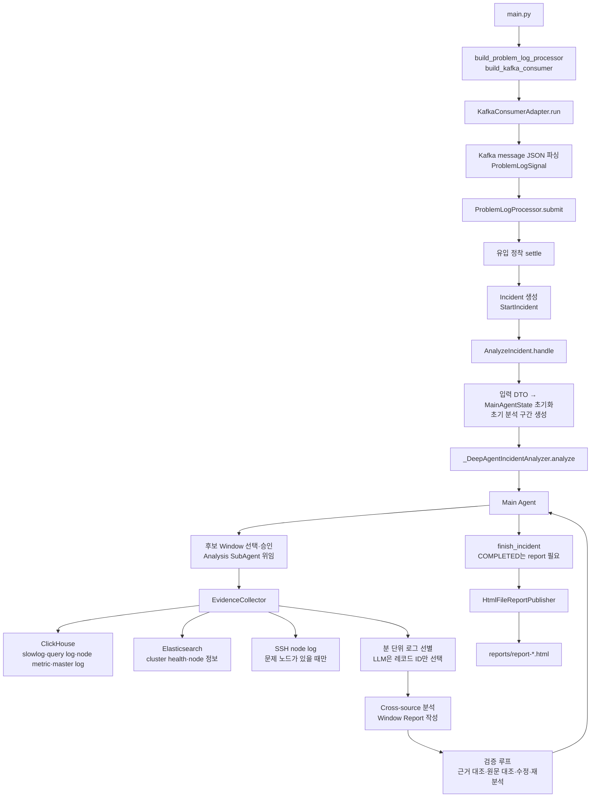

# ClusterDoctor

ClusterDoctor는 `KAFKA_TOPIC`에 지정된 Kafka 토픽에서 문제성 로그 신호를 받아 유입이 멎기를 기다린 뒤,
인시던트 하나를 진단해 HTML 보고서 한 장을 만든다. 요청을 받는 HTTP 서비스가 아니라 계속
실행되는 Kafka consumer이며, HTTP analysis endpoint는 없다.

## 동작과 아키텍처

```text
slowlog·master log error → 외부 수집·전송 → Kafka(KAFKA_TOPIC) → ClusterDoctor
상세 로그·메트릭         → 외부 적재      → ClickHouse         → 분석 시 조회
```

slowlog와 master log error를 같은 지정 토픽에 넣는다. 수신 코드는 로그 종류를 필터링하지 않고
메시지에서 발생 시각을 읽어 `ProblemLogSignal`을 만든다. 상세 분석은 ClickHouse를 조회하므로
분석할 원본 로그도 해당 테이블에 적재되어 있어야 한다. Kafka 수신부터 최종 보고서까지의 흐름은 다음과 같다.

```text
KafkaConsumerAdapter
  → ProblemLogProcessor: quiet-period settling
  → StartIncident
  → AnalyzeIncident: state, timeout/cancellation, delivery, cleanup
  → IncidentAnalyzer port: DeepAgents composite adapter
  → application report finalization and HTML publication
```

`ProblemLogProcessor`는 도착분을 큐 하나에 쌓아 두고, 30초 간격으로 유입을 확인해 연속
두 번 신규 항목이 없을 때 Incident를 만들어 그 자리에서 바로 분석까지 순차로 돈다
(누적 대기는 최대 5분). 정착과 분석은 하나의 루프라서, 한 Incident의 분석이 끝나야
다음 신호의 정착 판단을 시작한다 — 그 사이 들어온 새 이벤트는 큐에 쌓일 뿐이다.
새 이벤트를 분석 중인 Incident에 자동 합치거나 기존 Incident를 다시 실행하지 않는다.

코드는 "실행 주체 → 목적 → 구현 기술" 순으로 배치되어 있다. 어떤 계층에 있는지가
아니라 **누가 실행하는가**로 폴더를 찾는다.

```text
src/cluster_doctor/
├── main.py
├── bootstrap/              # Composition Root: configuration/dependency/lifecycle
├── kafka_consumer/         # Kafka 수신 + 정착(settling)
├── incident_orchestrator_agent/   # Main Agent: 분석 범위·수명 관리, 리포트 전달
└── incident_analysis_agent/       # Analysis SubAgent: 근거 수집·분석·검증
```

`kafka_consumer`는 `ProblemLogProcessor`를 직접 주입받는다. 실행 State는 각 Agent의
`agent/state.py`, 공유 데이터 계약은 owner의 `model/`, LLM schema는 해당
service/workflow에 둔다. Orchestrator가 Analysis 실행을 조립하며 Analysis는
Orchestrator에 의존하지 않는다. `bootstrap`은 공개 조립 함수로 구현체를 연결한다.

### Agent 구조

- Kafka inbound는 record를 `ProblemLogSignal`로 파싱해 `ProblemLogProcessor`에 넘긴다.
  `aiokafka` 의존성은 `kafka_consumer/consumer/kafka`에만 있다.
- `incident_analysis_agent/datasource`가 ClickHouse(`clickhouse/client.py`),
  Elasticsearch(`elasticsearch/cluster_health.py`, `node_resolver.py`),
  SSH(`ssh/node_log.py`)를 구현한다.
- `incident_orchestrator_agent/agent/adapter.py`가 유일한 조립 지점이다.
  `DeepAgentsConfig`와 `build_deepagents_incident_analyzer`를 공개하고, 내부에서
  structured LiteLLM caller, `ReportWriter`, metric threshold, `AnalysisSeams`,
  private `_DeepAgentIncidentAnalyzer`를 조립한다. `bootstrap`은 이 함수 하나만
  부르고 runtime·agent·service internals를 직접 import하지 않는다.

Main DeepAgent는 incident마다 새 graph를 만들고 tool loop를 돈다. 먼저 후보 window를
열거하고, 허용된 window를 선택·승인(`propose_analysis`)한 뒤 Analysis SubAgent에 `task`로
위임한다. 위임 결과(`LogAnalysisResponse`)의 요약을 읽고 공백이 남았으면 추가 window를
분석하고, 없으면 `finish_incident`로 종료한다. Main Agent의 도구는 `list_candidate_windows`,
`propose_analysis`, `finish_incident` 셋뿐이며, 시간·분·호출 상한은 runtime guardrail이 강제한다.

Analysis SubAgent는 승인된 window 하나를 끝까지 처리한다. evidence를 모으고 Window Report를
작성한 뒤, 같은 DeepAgent의 `after_agent` middleware가 리포트를 검증한다.
`validate_report`는 근거 및 candidate 참조 ID의 유효성만 확인하고,
`GroundingValidator`가 Claim을 수집된 evidence·observation과 대조한다. 표현 불일치는 `revise_report`로
최대 2회 고치고, 분석 불일치는 같은 window를 1회 다시 분석한다. 그래도 남으면
`MISMATCH`로, 대조하지 못했으면 `NOT_VERIFIED`로 리포트를 저장하고 반환한다.
`COMPLETED` 종료에는 window report가 하나 이상 있어야 한다.

window report는 합치지 않고 window마다 `MainAgentState.window_results`에 리포트 객체를
그대로 쌓는다(별도 저장소를 거치지 않는다). `AnalyzeIncident`는 마지막 window의 report를
대표로 HTML에 전달하고, 모든 window의 검증 불일치를 gap으로 싣는다. Candidate를 prompt에
보이는 방식과 HTML에 보이는 방식은 각각 `service/observation`과
`service/report_delivery/rendering`에서 따로 projection한다.

## 분석 모델

Main Agent는 raw log를 보지 않는다. Agent 사이에는 request/response와 요약만 흐르고,
evidence·원문·report·observation은 각 Agent의 유일한 State가 직접 소유한다.
Analysis는 자신의 최종 State를 `WindowAnalysisResult`로 투영하고, Orchestrator
어댑터가 결과를 Main State update에 반영한다. State 객체는 Agent 간에 공유하지 않는다.
그래야 Main Agent context가 raw log로 불어나지 않는다.

각 datasource는 raw log를 1분 bucket으로 나눠 Map/Reduce로 evidence를 고른다. 모델은 번호와
선택 이유만 돌려주며 timestamp, node, message는 code가 수집한 DTO에서 옮긴다. Reduce는 root
cause를 확정하지 않는다. 모든 datasource evidence가 모인 뒤 cross-source 단계가 원인 후보를
다룬다. 비어 있는 분은 호출하지 않고, 실패한 분은 `[분석 실패]`와 gap으로 남긴다.

노드 metric은 LLM을 거치지 않는다. heap, queue, rejected의 임계값을 넘은 최고점을 code가
evidence로 만든다. master node log는 ClickHouse에서 매 window 읽고, data node log는 master
evidence로 후보가 생겼을 때만 `NodeResolver`와 SSH를 통해 읽는다.

## 보고서

Incident 하나당 `REPORT_DIR` 아래 HTML 파일 하나를 쓴다. `IncidentAnalysisReport`는 code가 센
`observations`와 모델이 쓴 `narrative`를 분리한다. 숫자와 slow-query candidate 값은 code가
정확히 아는 값이므로 모델에게 옮겨 적게 하지 않는다. Narrative의 주장에는 evidence reference가
붙는다. 코드 검사는 참조 ID의 유효성만 확인한다. 수치·시각·노드·인과·확신도의 의미 판단은 검증 프롬프트가 담당한다.

실제 양식은 **Elasticsearch 쿼리·노드 로그 분석**이다. 핵심 요약 → 실행 로그 건수/최대 실행시간 SVG 추이 → 주요 타임라인 → 느린 개별 실행 로그 → 마스터 노드 로그 → slowlog 로그 → SSH 노드 로그 → 시스템 지표 → 원인 판단·조치 순으로 표시한다. 개별 실행·slowlog·SSH 로그는 각각 최대 10건, 마스터 로그는 최대 120건, 타임라인은 최대 8개이며 최대 실행시간 로그는 타임라인에 반드시 포함한다. 마스터 섹션은 `observations.master_events`, slowlog·SSH 섹션은 소스별 선별 `evidence`를 읽는다. 모든 섹션은 고정되며, 항목이 없으면 제목 아래에 소스별 수집 상태(`source_statuses`)에 따른 한 줄 안내(`특이사항 없음`, `수집 실패: 사유`, `수집 상태 미확인`, SSH는 `마스터 로그에서 조사 대상 노드가 없어 수집하지 않음` 등)를 표시한다. 쿼리 로그는 항상 있어야 하는 소스라 비어 있으면 수집 이상으로 안내하고, 마스터 로그·slowlog는 없어도 정상일 수 있으며, SSH 노드 로그는 마스터 로그에서 문제 노드가 나올 때만 수집을 시도한다(시도하지 않으면 `skipped`). 전체 slowlog·SSH 원문 저장 범위를 확대하지 않는다.

총건수는 전체 `Observations.query_requests` 길이이며 bulk/update도 포함한다. 유한하고 0 이상인 `run_time`으로 순위를 매긴다. 같은 최대 5개 키워드를 가진 실행을 합치거나 평균·키워드별 기여도를 산출하지 않는다. 요청 호스트와 URL의 Elasticsearch 대상을 구분하고, 조건은 해당 실행의 DSL에서만 가져온다. 내부 Evidence/Candidate ID와 근거 링크는 표시하지 않는다. 쿼리 로그는 필요한 컬럼만 조회하고, url은 수집 시 대상 호스트·인덱스·조건으로 파싱해 저장하며 원문은 보관하지 않는다.

SSH 로그에는 실제 파일 경로와 원문을 본문에 표시한다. `time_origin=parsed`만 정확한 타임라인 시각으로 사용하며 inherited/fallback은 시각 미확인 문맥이다. 수집 실패 분은 0건으로 그리지 않는다. `rejected`는 누적값이며 이번 구간의 실패나 회복으로 해석하지 않는다. 시스템 지표는 측정된 노드별 최대값을 표시한다. 조회 시점 cluster health는 과거 사고 상태로 보고서에 싣지 않는다.

요약·finding 제목/상세·원인/반증·권고·후보 선정 이유를 claim별 원문과 대조한다. 원문과 명확히 충돌할 때만 `MISMATCH`, 나머지는 `PASSED`다. 근거 부족·원문 미확보·절단·인과 미입증은 자동 탈락 사유가 아니다. `PASSED`는 사실 입증이 아닌 명확한 모순 미발견을 의미한다. 모든 claim_id에 완전한 판정이 있어야 하며 호출 실패·잘못된 JSON·빈/누락/중복/알 수 없는 응답은 검증 실행 오류로 남긴다. 가장 느린 실행 상위 5개는 코드가 분석 근거에 포함한다. 검증 실행 오류가 있으면 분석을 승격하지 않고 같은 요약·원인 슬롯에 관측 기반 내용을 채운다. 내부 검증 상태·사유는 본문에 표시하지 않고 로그에 남긴다. SVG와 원문은 인쇄 시에도 표시하고 외부 웹폰트·CDN을 사용하지 않는다.

합성 DTO와 고정 분석문으로 실제 publisher 결과를 확인하려면:

```bash
uv run python scripts/preview_report.py --variant ssh --output reports/example.html
uv run python scripts/preview_report.py --variant mismatch --output reports/mismatch.html
uv run python scripts/evaluate_report_prompts.py --mode offline --output reports/offline-evaluation.json
uv run python scripts/evaluate_report_prompts.py --mode live --output reports/live-evaluation.json
```

preview는 HTML과 같은 이름의 평문을 함께 저장한다. offline의 10개 고정 응답 사례는 계산과 검증 응답 계약을 확인하며 모델 진단 정확도를 증명하지 않는다. live는 기존 `.env`의 모델로 사례별 초안/근거 검증을 각각 한 번 호출하고 결과를 별도로 기록한다. live CLI는 기본 120초의 전체 실행 예산을 적용하며 `--budget-seconds`로 조절한다(Unix). 응답 지연·호출 실패는 미완료로 기록한다. 금지 표현 탐지는 사람의 검토를 위한 표시이며 의미 평가를 대체하지 않는다.

모델이 빈 draft를 주거나 report 저장이 실패해도 observation은 전달한다. HTML 파일을 쓸 수
없으면 scrubbed plain text를 log로 남긴다. 모든 text는 escape하며 report 파일은 쿼리 조건과
company/user 식별자를 담을 수 있으므로 `reports/`는 Git에 넣지 않는다.

LLM에 전달하는 IP·이메일·등록된 회사·사용자·요청 ID는 가명으로 바꾸고 응답에서
복원한다. 가명 대응표는 Incident마다 새로 만들며, 같은 Incident의 Main/SubAgent와
병렬 조회·분 단위 분석이 공유한다. 분석이 성공하거나 실패해 종료되면 대응표를
해제하므로, 상시 실행 중 이전 Incident의 식별자가 누적되지 않는다. 키워드·노드 이름·
쿼리 본문과 저장된 원본 데이터는 이 가명 처리의 대상이 아니다.

## 요구 사항

- Python 3.13 이상과 [uv](https://docs.astral.sh/uv/)
- `KAFKA_TOPIC`으로 지정한 토픽에 문제성 로그를 전달하는 Kafka
- slowlog, query log, node metric, node log table을 가진 ClickHouse
- cluster health 조회용 Elasticsearch
- Gemini 또는 NVIDIA NIM API key 하나
- 선택: data-node log를 읽을 SSH credential

## 설정

환경 변수 또는 project root `.env`를 `src/cluster_doctor/bootstrap/configuration/settings.py`가 읽는다.
`.env.example`을 `.env`로 복사하고 실제 key는 commit하지 않는다. 필수 설정이 없으면 첫
첫 문제성 로그 신호까지 기다리지 않고 기동 시점에 실패하며, 오류는 secret value를 출력하지 않는다.

| 변수 | 기본값 | 설명 |
|---|---:|---|
| `LLM_PROVIDER` | `gemini` | `gemini` 또는 `nvidia_nim` |
| `GEMINI_API_KEY`, `NVIDIA_API_KEY` | — | 선택한 provider의 key |
| `GEMINI_MODEL` | `gemini-3.5-flash-lite` | Gemini model |
| `NVIDIA_MODEL` | `google/gemma-4-31b-it` | NIM model; local cost map에 없어 cost가 0일 수 있음 |
| `CLICKHOUSE_URL` | — | 예: `jdbc:clickhouse://host:8123/packetbeat`; 이 database에 아래 네 table이 있어야 함 |
| `CLICKHOUSE_USER`, `CLICKHOUSE_PASSWORD` | `default`, empty | ClickHouse credential |
| `CLICKHOUSE_SLOWLOG_TABLE`, `CLICKHOUSE_LOG_TABLE` | `slowlog_v2`, `log` | slowlog와 query log table |
| `CLICKHOUSE_NODE_METRIC_TABLE`, `CLICKHOUSE_NODE_LOG_TABLE` | `es_node_metric`, `loki_logs` | node metric과 master-node log table |
| `ES_HOST`, `ES_PORT` | —, `9200` | comma-separated host와 port |
| `ES_USER`, `ES_PASSWORD` | empty | 비면 basic auth를 사용하지 않음 |
| `SSH_USER`, `SSH_PASSWORD`, `SSH_PORT` | empty, empty, `22` | data-node log용 SSH |
| `KAFKA_BOOTSTRAP_SERVERS`, `KAFKA_TOPIC`, `KAFKA_GROUP_ID` | `localhost:9092`, `slowlog`, `clusterdoctor` | consumer 설정 |
| `KAFKA_FAILURE_TIMEOUT_SECONDS` | `300` | Kafka 연결 확인의 연속 실패 상한(초), 양수만 허용 |
| `CLUSTER_NAME` | `elasticsearch` | 표시 이름 |
| `NODE_HEAP_WARN_PERCENT`, `NODE_QUEUE_WARN` | `85`, `100` | metric evidence threshold |
| `REPORT_DIR` | `reports` | HTML 보고서 저장 디렉터리. 미지정·빈 값이면 `reports`, 상대 경로는 작업 디렉터리 기준 |
| `REPORT_SFTP_HOST`, `REPORT_SFTP_PORT`, `REPORT_SFTP_USER`, `REPORT_SFTP_PASSWORD`, `REPORT_SFTP_KEY_FILE`, `REPORT_SFTP_REMOTE_DIR`, `REPORT_SFTP_KNOWN_HOSTS`, `REPORT_SFTP_TIMEOUT_SECONDS` | (꺼짐), `22`, …, `10` | 리포트를 SFTP로 다른 서버에 올린다. HOST가 비면 꺼진다. 켜면 USER·REMOTE_DIR과 PASSWORD 또는 KEY_FILE이 필요하다 |
| `LOG_DIR` | `logs` | `app.log` 저장 디렉터리. 미지정·빈 값이면 `logs`, 상대 경로는 작업 디렉터리 기준 |
| `LOG_MAX_BYTES`, `LOG_BACKUP_COUNT` | `10485760`, `5` | `app.log` 로테이션. 크기를 넘으면 `app.log.1`…로 넘기고 백업은 개수까지만 남긴다(총량 약 `(LOG_BACKUP_COUNT + 1) * LOG_MAX_BYTES`). 양수만 허용, 빈 값이면 기본값 |
| `LITELLM_LOCAL_MODEL_COST_MAP` | `True` | litellm의 GitHub cost-map fetch를 막음 |

Kafka offset은 `(group, topic, partition)` 기준이다. 새 topic에 committed offset이 없으면
`auto_offset_reset=latest`로 끝에서 시작한다.

consumer 기동 후에는 연결 검사 완료 후 10초를 기다렸다가 다음 검사를 수행한다.
검사는 구독 topic의 존재, 할당된 partition leader의 `end_offsets()` 응답,
consumer group coordinator의 `committed()` 응답을 확인한다. 이 조회들은 메시지를
소비하거나 consumer 위치·committed offset을 변경하지 않는다. 메시지가 없거나
offset이 0이어도 정상이며, committed offset이 없는 `None` 응답도 정상이다.
할당이 완료된 대기 consumer는 topic metadata와 coordinator만 확인하므로 다른
consumer가 담당하는 partition leader 장애로 종료하지 않는다. 리밸런싱 중이거나
검사 도중 할당이 바뀌면 실패 시간을 초기화하지 않고 다음 검사에서 다시 판단한다.
전체 검사 한 번은 최대 10초(장애 상한까지 남은 시간이 더 짧으면 그 시간)만
기다리며, 정상 확인 실패가 `KAFKA_FAILURE_TIMEOUT_SECONDS` 동안 연속되면 consumer 종료를
시도한다(정리 대기 최대 10초). 연결이 복구되면 실패 누적 시간을 초기화한다.
앱은 종료 사유를 로그로 남긴 뒤 코드 1로 프로세스 전체를 종료한다. 이때 대기 중이거나
진행 중인 분석은 폐기하며 분석 스레드의 완료를 기다리지 않는다. 기동 중 Kafka 오류도
실패 종료하며, consumer 기동 대기는 같은 설정값으로 제한한다.
자동 재시작은 앱 자체가 아닌 실행 관리자에서 설정한다.

### 고정 한도

다음은 환경 변수가 아닌 runtime 상수다. 위치는 실행 주체 중심 패키지 구조를 기준으로 한다.

| 한도 | 값 | 위치 |
|---|---:|---|
| analysis window | 10분 | `incident_analysis_agent/model/time_range.py` |
| incident analysis budget | 60분, 12회 | `incident_orchestrator_agent/service/analysis_window/guardrails.py` |
| main agent cycle / rejected decision | 16회 / 3회 | `incident_orchestrator_agent/service/analysis_window/guardrails.py` |
| settling wait | 30초 quiet period, 300초 total | `kafka_consumer/trigger_settling/service/problem_log_processor.py` |
| incident timeout | 30분 | `incident_orchestrator_agent/service/analysis_window/guardrails.py` |
| evidence | source당 25, 전체 80 | `incident_analysis_agent/service/evidence_collection/limits.py` |
| raw prompt text | 60,000자 | `incident_analysis_agent/service/evidence_collection/limits.py` |
| node investigation | 2 nodes | `incident_analysis_agent/service/node_investigation/node_investigation.py` |
| source query rows | source·minute당 10,000 | `incident_analysis_agent/datasource/clickhouse/client.py` |
| master log | window당 300, report당 120 | `incident_analysis_agent/service/observation/builder.py` |
| ClickHouse node-log | default 300, hard cap 2,000 | `incident_analysis_agent/datasource/clickhouse/client.py` |
| SSH node-log | default 300 | `incident_analysis_agent/datasource/ssh/node_log.py` |
| SSH timeout | connect 10초, command 30초 | `incident_analysis_agent/datasource/ssh/node_log.py` |
| LLM timeout | 1,200초 | `incident_analysis_agent/agent/runtime/litellm_client.py` |
| ClickHouse timeout | 30초 | `bootstrap/dependency/wiring.py` |

### 재시도와 rate limit

LLM 호출은 `litellm.completion(num_retries=0)` 경로만 쓴다. 가장 흔한 실패는 429이고, 같은 큰
prompt를 재시도해도 quota를 회복하지 못하며 token 소비만 증가한다. Gemini free tier의
분당 입력 token 250,000에 대해 5분 window가 약 513,122 input token을 쓴 실측이 있다.
추가 window 분석, 리포트 수정·재분석, 원문 대조 검증도 추가 token을 소비한다.

client는 status와 whitelist된 rate-limit header만 log로 남긴다. response body, request URL,
`str(exc)`는 key를 포함할 수 있어 기록하지 않는다. retry를 끈 대가로 일시적인 5xx도 자동
retry하지 않지만, failed minute은 전체 incident를 버리지 않고 gap으로 보고된다.

## 설치와 실행

```bash
uv sync
uv run python -m cluster_doctor.main
```

Kafka consumer는 block하며 log는 stderr와 `LOG_DIR/app.log`, report는 `REPORT_DIR`에 남긴다.
`.env`에 `LOG_DIR=/var/log/clusterdoctor`처럼 절대 경로를 지정할 수 있다. 지정하지
않거나 빈 값이면 기존처럼 작업 디렉터리의 `logs/app.log`에 저장한다. 디렉터리가
없으면 자동 생성하며, 실행 계정에 쓰기 권한이 있어야 한다. `app.log`는 크기 기준으로
로테이션한다(기본 10MB, 백업 5개). Windows에서는 편집기 등이 `app.log`를 열어 두면
로테이션 시점의 이름 변경이 실패할 수 있다(로그 기록 오류는 콘솔에만 남고 분석은 계속된다).
보고서는 `.env`의 `REPORT_DIR=/var/lib/clusterdoctor/reports`로 경로를 지정한다.
미지정하거나 빈 값이면 기존처럼 작업 디렉터리의 `reports/`에 저장한다.
리포트를 다른 서버로도 보내려면 `REPORT_SFTP_*`를 채운다. 리포트는 항상 `REPORT_DIR`에 먼저
저장하고, 저장에 성공한 파일을 SFTP로 올린다(네트워크 오류는 한 번 더 시도하고, 그래도 실패하면 로그만
남긴다. 인증 실패·호스트 키 불일치·권한 오류는 다시 시도하지 않는다). 업로드는 사건 처리 흐름 안에서
기다리므로 서버에 접속할 수 없으면 그 사건의 리포트 게시가 약 20초, 전송 도중 서버가 멈추면 그보다 더 늦어질 수
있다(`REPORT_SFTP_TIMEOUT_SECONDS`로 조절). 업로드는 임시 이름(`.part`)으로 올린 뒤 이름을 바꾸므로 받는 쪽이
쓰다 만 파일을 보지 않고, 같은 이름이 있으면 `-2`, `-3`을 붙여 덮어쓰지 않는다. 원격 디렉터리가 없으면
만든다. 로컬 `REPORT_DIR`의 파일은 자동으로 지우지 않는다. 접속 정보를 바꾼 뒤에는
`uv run python scripts/upload_report_sftp.py`로 가장 최근 리포트 한 건을 올려 접속·인증·쓰기 권한을
확인할 수 있다. `REPORT_SFTP_KNOWN_HOSTS`를 비우면 서버 호스트 키를 검증하지 않으므로 운영에서는
known_hosts 파일을 지정하는 것을 권장한다.
실제 문제성 로그 발생을 기다리지 않고 분석 시작 신호를 확인할 때는 다음을 쓴다.

```bash
uv run python scripts/produce_test_message.py --at "2026-09-16T04:22:00" --count 3
```

### Docker Compose 통합 실행

실제 Gemini 또는 NVIDIA NIM API를 호출하는 로컬 통합 실행이다. Kafka 문제성 로그 신호 수신,
ClickHouse 조회, Elasticsearch cluster health 조회, LLM 분석, HTML 보고서 생성을 한 번에
확인한다. Docker에서는 Kafka·ClickHouse·Elasticsearch만 실행하고, ClusterDoctor는
로컬 가상환경에서 실행한다. `.env`에 LLM API key와 아래 연결 설정을 넣는다.

```dotenv
CLICKHOUSE_URL=jdbc:clickhouse://localhost:8123/packetbeat?compress=0
CLICKHOUSE_USER=clusterdoctor
CLICKHOUSE_PASSWORD=clusterdoctor
ES_HOST=localhost
ES_PORT=9200
ES_USER=
ES_PASSWORD=
KAFKA_BOOTSTRAP_SERVERS=localhost:29092
KAFKA_TOPIC=slowlog
KAFKA_GROUP_ID=clusterdoctor
```

```bash
docker compose up -d
.venv/bin/python -m cluster_doctor.main
```

`Kafka consumer started`가 보이면 다른 터미널에서 신호를 보낸다. consumer의 `auto_offset_reset=latest` 때문에 consumer 기동 전에 보낸
메시지는 읽지 않는다.

```bash
.venv/bin/python scripts/produce_test_message.py --at "2026-01-15T10:00:00+09:00"
```

고정된 fixture 시각은 오래된 이벤트로 처리되어 분석 구간에서 제외될 수 있다.
근거 수집까지 검증하려면 ClickHouse 데이터와 이벤트 시각을 최근의 동일한 구간으로 맞춘다.

초기 정착 대기와 실제 LLM 호출이 끝난 뒤 `reports/`에 HTML 파일이 생긴다.

```bash
ls reports/report-*.html
docker compose down
```

ClickHouse fixture는 `docker/clickhouse/init.sql`이 빈 Compose 볼륨을 처음 만들 때만
적재한다. fixture를 처음 상태로 다시 만들려면 `docker compose down -v`로 볼륨을 지운 뒤
다시 기동한다.

Kafka와 settling을 건너뛰고 같은 `AnalyzeIncident` path를 특정 시각에 실행하려면
`run_analysis.py`를 쓴다. 아래 첫 명령은 **preflight only**이며 moment와 range만 계산하고
`RunManualAnalysis`를 호출하지 않는다. 두 번째 명령이 실제 ClickHouse, Elasticsearch, SSH,
LLM을 호출하는 direct diagnosis다.

```bash
# dry-run preflight: no RunManualAnalysis, no external diagnosis calls
uv run python scripts/run_analysis.py --at "2026-09-16T04:22:00" --span 6m --dry-run

# actual direct diagnosis: invokes RunManualAnalysis
uv run python scripts/run_analysis.py --at "2026-09-16T04:22:00" --span 6m
```

## 코드 workflow

아래는 Kafka 이벤트를 settling으로 묶은 Incident가 HTML 보고서가 되기까지의 호출 경로다.
`main.py`는 조립만 하고, 각 단계의 규칙은 실행 주체별 모듈(`kafka_consumer`,
`incident_orchestrator_agent`, `incident_analysis_agent`)에 둔다.



### 단계별 코드 위치

| 단계 | 책임 | 시작 코드 |
|---|---|---|
| 프로세스 시작 | 설정을 읽고 Kafka consumer를 실행 | `src/cluster_doctor/main.py` |
| 의존성 조립 | 서비스와 ClickHouse·ES·SSH·LLM·report 구현 연결 | `src/cluster_doctor/bootstrap/dependency/wiring.py` |
| Kafka 수신 | JSON에서 event time을 읽어 `ProblemLogSignal`로 변환 | `src/cluster_doctor/kafka_consumer/consumer/kafka/consumer.py` |
| Incident 묶기·대기 | quiet period 정착과 순차 분석 루프 | `src/cluster_doctor/kafka_consumer/trigger_settling/service/problem_log_processor.py` |
| 진단 lifecycle | 상태 생성, timeout, 결과 전달 | `src/cluster_doctor/incident_orchestrator_agent/service/incident_lifecycle/analyze_incident.py` |
| Main Agent | 분석 범위 선택·승인, SubAgent 위임, 충분성 판단·종료 | `src/cluster_doctor/incident_orchestrator_agent/agent/adapter.py` |
| 근거 수집 | ClickHouse·ES·SSH 조회와 분 단위 선별 | `src/cluster_doctor/incident_analysis_agent/service/evidence_collection/collector.py` |
| 근거 일관성 검증 | evidence 및 candidate 참조 ID 유효성을 확인하는 구조 검사 | `src/cluster_doctor/incident_analysis_agent/service/validation/consistency/report_validation.py` |
| 원문 대조 검증 | Claim을 수집된 evidence·observation과 대조하고 불일치를 분류 | `src/cluster_doctor/incident_analysis_agent/service/validation/grounding/grounding_validator.py` |
| 검증 루프 | 검증 결과에 따라 리포트 수정·구간 재분석 | `src/cluster_doctor/incident_analysis_agent/agent/subagent.py` |
| HTML 저장 | 대표 리포트를 `reports/`에 기록 | `src/cluster_doctor/incident_orchestrator_agent/service/report_delivery/rendering/html/html_file_notifier.py` |

Kafka를 거치지 않는 수동 실행은 `scripts/run_analysis.py`에서
`RunManualAnalysis`를 호출한다. 이 경로는 Kafka 수신·정착만 생략하고,
그 뒤의 `AnalyzeIncident`와 Agent workflow는 같은 구현을 사용한다.

## 데이터 소스와 metric 해석

분 단위 구간마다 slowlog·쿼리 로그·노드 메트릭을 최대 3개의 작업으로 병렬 조회한다.
각 소스는 독립적으로 성공·실패 처리하며, 성공한 결과는 유지하고 실패한 소스와
조회 구간·오류는 리포트의 수집 누락 정보에 남긴다. 정상 조회 0건은 실패로 취급하지 않는다.
공유 ClickHouse HTTP client는 자동 세션 ID를 끄고 독립적인 조회를 실행한다.

| table | time column | 내용 |
|---|---|---|
| `slowlog_v2` | `_source.@timestamp` | slow query index, node, took, hits, shards, query, opaque-id fields |
| `log` | `reg_date` | 쿼리 로그 전체 컬럼: reg_date, 실행 시간·유형, 검색 기간·일수, 키워드·사용자·회사, URL·건수·etc 등 |
| `es_node_metric` | `reg_date` | CPU, OS memory, JVM heap, search/write queue와 rejected |
| `loki_logs` | `timestamp` | master node log line, role, level, logger, filename, host |

시간은 KST-aware value로 읽는다. `slowlog_v2`는 ClickHouse ingest 시각인 `ch_ingested_at`이
아닌 Elasticsearch event time인 `_source.@timestamp`로 filter한다. ingest delay가 분 경계를
넘으면 trigger를 만든 원본 slowlog 자체를 빠뜨릴 수 있기 때문이다. `slowlog_v2`와 `loki_logs`는
평시 0건이 정상인 incident-oriented log다.

`os_mem`은 `_nodes/stats`의 `os.mem.used_percent`로 page cache를 포함한다. Elasticsearch는
남는 RAM을 cache로 쓰므로 95–99% 자체는 memory pressure가 아니다. pressure는 `jvm_heap`,
GC warning, `search_rejected`와 함께 판단한다. `_source` document는 필요한 named JSON field만
선택해 prompt token을 줄인다.

## 배포 메모

최초 `import litellm`은 tiktoken `cl100k_base` encoding을
`openaipublic.blob.core.windows.net`에서 받을 수 있다. cache가 비어 있는 network-isolated
환경에서는 import가 지연된 뒤 `ProxyError`로 process가 시작하지 못할 수 있다. image build
중 cache를 데우면 된다.

```dockerfile
RUN python -c "import litellm"
```

`LITELLM_LOCAL_MODEL_COST_MAP=True`는 별도의 GitHub cost-map fetch만 막고 tiktoken fetch에는
영향이 없다. litellm image 크기를 줄일 때 proxy experimental output·swagger 같은 사용하지 않는
asset만 제거하고, `litellm/proxy/` 전체는 실제 `completion()` 경로가 사용하므로 제거하지 않는다.

## 알려진 한계

- 무료 tier token quota에는 여전히 닿을 수 있다. prompt 크기 자체를 줄이지 않으면 retry를
  막아도 busy window가 quota를 넘는다.
- 모델 narrative field는 실행마다 비어 있을 수 있다. 구조는 빈 narrative에도 observation과
  gap을 전달하지만, 모델 판단의 근본 해결은 아니다.
- 대기 큐는 메모리 기반이다. 프로세스 종료 시 대기 중인 문제성 로그 신호를 영속 복구하지 않으며,
  실패한 Incident를 자동 재실행하지 않는다. 큐가 가득 차면 새 신호를 기다리지 않고 버린다.
- master log 0건과 아직 ingest되지 않음을 구별하지 못한다. 마스터 로그는 ClickHouse에서만
  조회하며, 조회 실패는 gap으로 표시한다. 마스터 노드로 SSH 폴백하지 않는다.
- data-node log는 SSH credential과 network reachability에 의존한다. Elasticsearch `_nodes`가
  내부 주소를 돌려주면 외부 실행 host의 SSH는 timeout 뒤 gap으로 남는다.

## 검증

```bash
git diff --check
uv run python -m compileall -q src
uv run python -c "import cluster_doctor; import cluster_doctor.bootstrap.dependency.wiring"
uv run pytest
```

`tests/unit`은 각 Agent의 model·datasource·service·agent 단위를 외부 의존 없이
검증하고, `tests/integration`은 Agent 결과/HTML publication처럼 여러 모듈이
맞물리는 경로를 확인한다. 실제 외부 시스템과 보고서 생성은 위 Docker Compose
통합 실행으로 확인한다.
